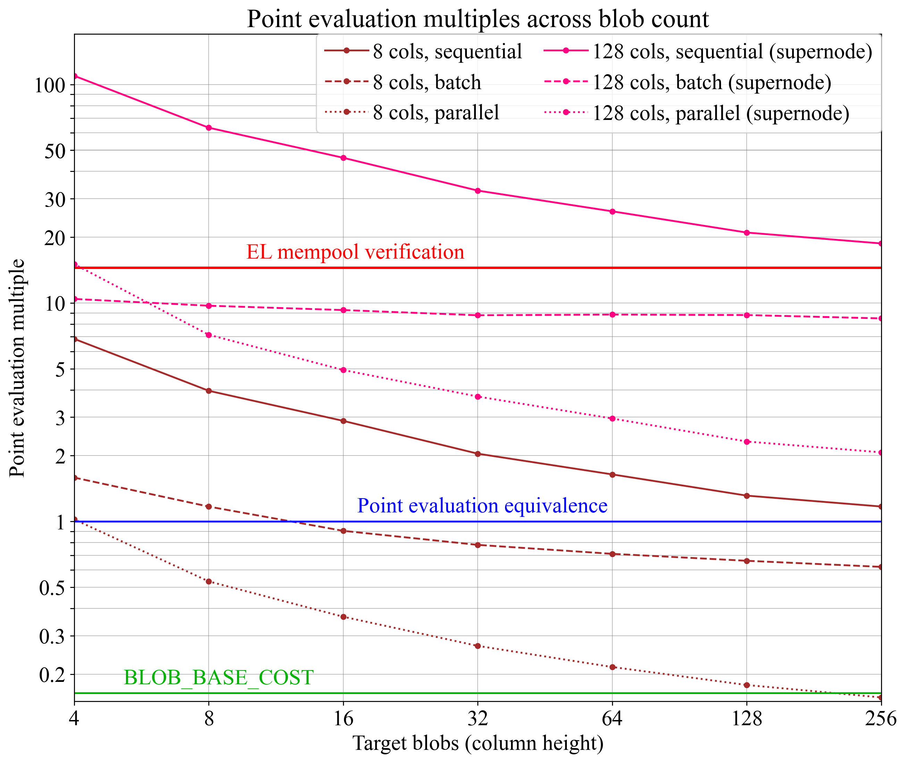
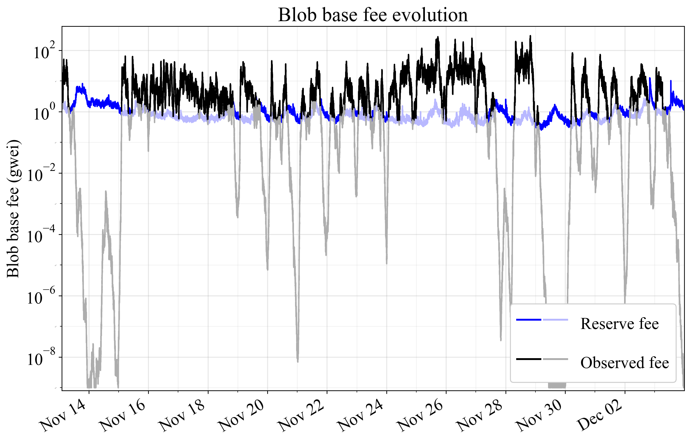
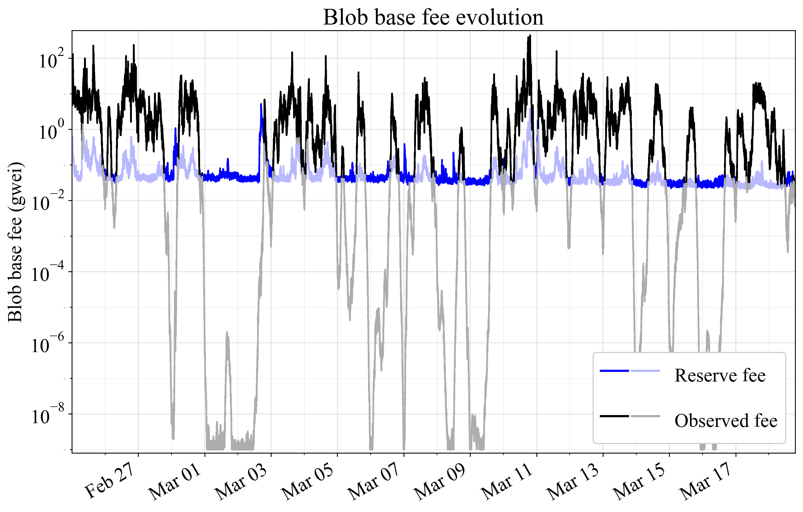

## Abstract

This EIP assigns a reserve price `BLOB_BASE_COST * base_fee_per_gas` to blobs by introducing an `if`-clause in `calc_excess_blob_gas()`. Specifically, when the reserve price is higher than `GAS_PER_BLOB * base_fee_per_blob_gas`, the function will not subtract `target_blob_gas` from `excess_blob_gas`, instead imposing `excess_blob_gas` to increase according to `blob_gas_used`, but rebalanced to maintain the same maximum increase. The proposal ensures that the blob fee market can function properly and that blob consumers pay at least a relevant fraction of the market rate for the compute they request from nodes.

## Motivation

Ethereum uses a dynamic pricing auction to set the blob base fee, lowering the fee if less gas is consumed than `target_blob_gas = GAS_PER_BLOB * blobSchedule.target` and raising the fee if more gas is consumed. Such an auction can function well when the blob base fee represents the price signal, allowing the mechanism to control the real price facing the consumer. However, when a rollup's costs are dominated by, e.g., executing blob-carrying transactions, ZK proof verification, or paying priority fees, the price signal is lost. The blob base fee no longer represents a significant component of the total cost facing the consumer, and the protocol can no longer rely on the blob base fee to control the equilibrium quantity of blobs consumed. The current mechanism can therefore end up repeatedly lowering the blob base fee until it eventually settles at 1 wei. A change in the blob base fee of 10% may under such circumstances shift the total cost of utilizing blobspace by just 0.0000001%. Whenever demand picks up, over an hour of near-full blocks is required to restore a market-clearing equilibrium fee, with the mechanism intermittently resorting to a first-price auction, considered a worse UX by blob consumers. The resulting spikiness in resource consumption is suboptimal for scaling blobspace. 

Figure 1 shows how execution costs make the real demand curve inelastic, such that relatively small shifts in organic demand or execution base fee (arrows) can lead to dramatic shifts in the equilibrium blob base fee. To alleviate this, the proposal imposes a reserve price, that reflects execution costs, through a simple `if`-clause in `calc_excess_blob_gas()`. The equilibrium (squares) must then form somewhere along the edge of the upper-left quadrant, bounded by the blue supply curve and the dashed curve representing possible reserve price equilibria under real demand (see rationale for a further elaboration).

The reserve price also fulfills a second function. Nodes must cryptographically verify KZG `proofs` to ensure that associated `commitments` correspond to provided blobs. This process is computationally expensive. It seems desirable to ensure that blob consumers pay at least some fraction of the market rate for the compute they impose on nodes. In this context, the execution base fee reflects how in-demand nodes' compute services are at the time that blob consumers request them. By applying the reserve price to the blob base fee, the proposal jointly ensures that:

1. The blob base fee update mechanism can function properly, by establishing a reserve price which is significant relative to L1 execution costs of the blob consumer. 
2. Blob consumers pay at least a relevant fraction of the market rate for the compute they request from nodes, with any additional fees for data determined independently in the blob fee market.


**Figure 1.** The real demand for blobspace under different execution base fees (black to red lines). When execution cost dominates, the real demand curve becomes inelastic and parallel to the supply curve, leading the equilibrium fee to change dramatically even with small shifts in the demand curve (arrows). The proposal imposes that the equilibrium (square) forms on the edges of the upper-left quadrant, at the intersection between the target supply curve and demand or along the dashed line representing possible reserve price equilibria accounting for execution costs.

## Specification

### Parameters

| Constant | Value 
| - | - |
| `BLOB_BASE_COST` | `2**13` |

### Functions

An `if`-clause is added to `calc_excess_blob_gas()` from [EIP-4844](./eip-4844.md). The function no longer subtracts `target_blob_gas` when updating `excess_blob_gas`, if the price of a `blob` is below the price of `BLOB_BASE_COST` execution gas. The `blobSchedule` for referencing target and max blobs was introduced in [EIP-7840](./eip-7840.md). The *current block's* `blobSchedule` is used during processing. Thus, when calculating the `base_fee_per_blob_gas` via `get_base_fee_per_blob_gas(parent)` after a hard fork, the `fake_exponential()` function is called with the *new* `blobSchedule.baseFeeUpdateFraction`. Likewise, the *new* `blobSchedule.max` and `blobSchedule.target` are used in `calc_excess_blob_gas()`.

```python
def calc_excess_blob_gas(parent: Header) -> int:
    target_blob_gas = GAS_PER_BLOB * blobSchedule.target
    if parent.excess_blob_gas + parent.blob_gas_used < target_blob_gas:
        return 0

    if BLOB_BASE_COST * parent.base_fee_per_gas > GAS_PER_BLOB * get_base_fee_per_blob_gas(parent):
        return parent.excess_blob_gas + parent.blob_gas_used * (blobSchedule.max - blobSchedule.target) // blobSchedule.max
    else:
        return parent.excess_blob_gas + parent.blob_gas_used - target_blob_gas
```

## Rationale

### Fee-inelasticity and reserve price

This proposal alleviates idiosyncrasies in the blob base fee auction. The fee update mechanism is unaware of the full price of the goods that it regulates the price for and therefore fails to converge on equilibrium in a timely manner. To resolve this, a link to the price of execution gas is required. A relatively high cost of execution gas renders changes to the blob base fee less effective in controlling quantity demanded—it is then ultimately the execution cost that determines equilibrium formation. Given that the protocol stipulates a long-run perfectly inelastic supply curve (vertical blue line in Figure 1), the blob base fee will simply fall to the boundary of 1 wei whenever the execution cost is too high for consumers to achieve equilibrium formation at `target_blog_gas`. Thus, in the regime where execution fees dominate, the demand curve is *blob fee-inelastic*, and whenever the blob fees dominate, the demand curve is *execution fee-inelastic*. Figure 1 illustrates the real demand function

$Q(b + c),$

mapping quantity of blobs demanded $Q$ to the blob base fee $b$ and the user's execution costs, expressed "per blob gas", $c$:

```python
c = execution_cost * base_fee_per_gas / GAS_PER_BLOB
```

If $c>0$, the demand curve will have an "inelasticity horizon" (see Figure 1), beyond which further reductions in $b$ no longer increase $Q$, rendering such fee reductions redundant:

$\lim_{b \to 0} Q(b + c) = Q(c).$

To avoid the inelasticity horizon, a reserve price $b_r$ is specified below which $b$ cannot be reduced further. It is calculated from the new constant `BLOB_BASE_COST` as: 

```python
b_r = BLOB_BASE_COST * base_fee_per_gas / GAS_PER_BLOB
```

As long as $b_r$ is a relevant fraction of $c$, the fee update mechanism will always be able to regulate demand by increasing the blob base fee whenever there is contention for blobspace, alleviating spikiness in resource consumption. The blob fee's share of the total price ($b+c$) will with the reserve price always be at least 

$\frac{b_r}{b_r+c}$, which simplifies to `BLOB_BASE_COST / (BLOB_BASE_COST + execution_cost)`.

This is why the equilibrium under the reserve price (dashed line in Figure 1) is situated a constant fraction $2^{13}/(2^{13}+10500)$ below the black demand curve formed under a 0 execution base fee.

The demand curve could potentially be somewhat inelastic even under zero execution costs. This would however just be another reason to move forward with this proposal. Regardless of the exact shape of the demand curve—which of course will remain unknown and can vary going forward—the proposal is based on something tangible affecting blob consumers. This makes it a justified neutral bound on the blob base fee.

The ratio between the reserve price for the blob base fee and the execution base fee is fixed: `BLOB_BASE_COST / GAS_PER_BLOB`, which is 1/16 with the proposed constant. The relationship follows from the new `if`-clause in `calc_excess_blob_gas()`.

### Blob KZG proof verification cost

EIP-4844 introduced the first phase of Ethereum's data availability sampling (DAS) roadmap. Validators on the consensus layer (CL) verify that the KZG `commitments` in the payload correspond to the provided `blobs` by cryptographically verifying the accompanying KZG `proofs`. Execution layer (EL) nodes must also validate the `tx_payload_body` and verify the wrapped data (blobs, commitments, and proofs) for every blob entering a node's tx pool. The computational requirements for verifying a KZG proof for an entire blob are slightly higher than those for verifying a KZG proof for a single point on that blob; the latter is the specific operation covered by the `POINT_EVALUATION_PRECOMPILE_GAS` (50000) charged to smart contracts.

[EIP-7594](./eip-7594.md) introduces PeerDAS. It changes compute requirements due to the reliance on blob cells and their individual proofs. The exact specification is not yet fully settled, but this is a rough guideline:

* EL nodes batch-verify `CELLS_PER_EXT_BLOB` (128) cell proofs for each blob before including a tx carrying that blob in their tx pool. This verification (e.g., using `verify_cell_kzg_proof_batch`) is roughly 15 times more expensive than the compute associated with a single `POINT_EVALUATION_PRECOMPILE_GAS` (which is for one `verify_kzg_proof`).
* Full nodes must verify 4 custodied columns, each column containing one cell from all blobs referenced in the payload. Each column's cell proofs can be batch-verified.
* Supernodes must verify 128 custodied columns, each column containing one cell from all blobs referenced in the payload. Each column's cell proofs can be batch-verified.
* Validators between full nodes and supernodes will custody between 4-128 columns.
* Nodes peer-sample `SAMPLES_PER_SLOT` (8) columns each slot (in addition to custodied columns). Each column's cell proofs can, as previously, be batch-verified.

For the verification performed on the CL in PeerDAS, the ability to jointly process cell proofs of a column (from all blobs) through batching reduces the compute time spent per blob as the number of blobs increases. When columns are batched sequentially, the compute time per blob is still quite high relative to the point evaluation. It is also possible to batch all columns jointly or to parallelize the processing across columns. When accounting for the prospect of parallelization for the CL, it is however worth remembering that the point evaluation proof verification performed by rollups using the precompile should generally not have many dependencies on other transactions in the execution block (both the point evaluation itself and operations taken conditional on the outcome) and thus also lends itself to parallelization. Such parallelization is an important current research focus. This means that a comparison between the point evaluation and the sequential processing of blobs (batched per column) is still relevant (because *both* could be parallelized). 

Figure 1 shows verification time per blob divided by the measured execution time of a single point evaluation operation (performed by the `VerifyKZGProof` precompile) for various configurations. The figure indicates that blobs under the current Fusaka PeerDAS specification will subject nodes to rather heavy compute requirements—when compared to the single point evaluation proof verification that a smart contract is charged `POINT_EVALUATION_PRECOMPILE_GAS` for. A full node would for example do the EL mempool verification for all blobs propagated p2p (already 15x). It would also sample 8 columns which at a target of 32 blobs requires 2x more time when done sequentially (batching each column separately), and they would finally custody 4 designated columns which are about equally as demanding as the point evaluation. How to price the KZG proof verification is however a complex question given the varying contexts in which it is performed. The proposed constant `BLOB_BASE_COST` is indicated by a green line and relatively moderate in comparison with the compute costs imposed on nodes. It is stipulated below the cost of full batching for DAS (8 columns), even under a very high blob count.



**Figure 2.** Verification time per blob relative to one point evaluation on an Apple M2 Max with 12 cores. The EL mempool verification (red) takes 15 times longer in the worst case, regardless of the blob target. The per-blob verification time of columns depends on the number of custodied/sampled columns and falls with an increase in the blob target due to speed-ups from processing all cells of a column jointly. Processing speeds up when batched or parallelized (albeit with more cores occupied in the latter case). The constant `BLOB_BASE_COST` is relatively moderate in comparison with the compute costs that blobs impose on nodes.

### Designing for the future

Future blob scaling is relevant to consider, the price of storing a fixed amount of data has fallen over the last 80 years. Technological progress generally brings down the unit cost of data services, as observed in many areas following Nielsen’s law and Moore’s law. The implication is that if Ethereum increases blob throughput by several orders of magnitude but does *not* scale blockspace, such that the execution base fee remains high, the stipulated reserve price of `BLOB_BASE_COST` execution gas will be too high. If Ethereum scales blockspace and blobspace roughly in synchrony, it is reasonable to expect that the stipulated reserve price remains at the desired level.

There is a specific reflexivity that is important to understand in this analysis. Aggregate ETH-denominated income from DA affects the fiat-denominated value of the ETH token, reflexively bounding the possible long-run ETH-denominated income, thus bounding the per-unit price of blobs. In essence, when selling more blobs at the same ETH-denominated price, the ETH token becomes more valuable, because the income per token rises. The ETH token price then increases, increasing the fiat-denominated blob costs facing the consumer, pushing down demand at the same blob base fee, thus pushing down the blob base fee under equilibrium.

For this reason, fixed thresholds not relating to blob quantity or the execution fee may not be sustainable. In a scenario where Ethereum sells more blobs per block, the equilibrium blob base fee should ideally have a relatively lower floor. Any fixed threshold (not relating to execution base fee or blob quantity) would need to be gradually readjusted to retain the same relative impact.

There are approximately 8 blobs per 1M blob gas. A target of 30M execution gas (i.e., gas limit 60M) and 240 blobs is thus equal in terms of gas. In a scenario with such a distribution, Ethereum would need to derive an at least 1/17th of its income from blob gas, given the fixed reserve price on the blob base fee of (1/16) of the execution fee. It seems desirable to strive for a fee market under which blobs are not all sold at reserve price, and it might be optimistic to assume that Ethereum can derive as much income from blob gas as execution gas. Assumptions around income potential and scaling of execution and blobs are therefore important to consider. If it is believed that blob gas will scale faster than execution gas, a slightly lower `BLOB_BASE_COST` would likely be reasonable.


### Delayed response during a quick rise in execution fees

When the `if` statement concludes that Ethereum operates in the execution-fee-led pricing regime, the blob base fee rises in accordance with `blob_gas_used * (max - target) // max`, without subtracting `target_blob_gas`. This is an intuitive way to return to the blob-fee-led pricing regime, retaining the same maximum fee increase while not allowing for a decrease. If the execution base fee rises quickly, there may be a few blocks before the blob base fee catches up (during which `target_blob_gas` will never be subtracted. This is arguably not an issue, and the smooth response in the blob base fee under these circumstances may even be seen as a benefit.

### Empirical analysis

Figures 3-4 show price evolution over three weeks in November 2024, when the average execution base fee was around 16 gwei, as well as in March 2025, when the average was around 1.3 gwei. The proposed reserve fee is applied directly to the original data, without accounting for its potential effect on the equilibrium fee. The equilibrium blob base fee would in reality rise from the threshold level once demand at this fee is above target supply. EIP-7918 imposes the maximum of the two curves, indicated in darker colors. 



**Figure 3.** Blob base fee evolution with the current fee market (black) and the proposed reserve fee (blue), during three weeks of November 2024 when the average execution base fee was around 16 gwei. EIP-7918 imposes the maximum of the two curves, as indicated in darker colors. Thresholding is applied directly to the original data, without accounting for its effect on the equilibrium fee.



**Figure 4.** Blob base fee evolution with the current fee market (black) and the proposed reserve fee (blue), during three weeks of March 2025 when the average execution base fee was around 1.3 gwei. EIP-7918 imposes the maximum of the two curves, as indicated in darker colors. Thresholding is applied directly to the original data, without accounting for its effect on the equilibrium fee.

Figure 5 shows histograms for observed fees and the maximum of the two curves for the four-month period from November 2024 (start of Figure 3's data period) through March 2025 (end of Figure 4's data period), corresponding to approximately 900k blocks beginning at block number 22075724. The histograms employ 100 log-spaced bins per decade (factor-of-ten increase), which are smoothed using a Hanning window of width 21 with mirror-reflected edges.


**Figure 5.** Histogram of the blob base fee when there is no threshold or when applying EIP-7918 (dashed combination of the darker black and blue curves from previous figures), with light smoothing applied. A four-month period from November 2024 through March 2025 was analyzed. Thresholding is applied directly to the original data, without accounting for its effect on the equilibrium fee.

### Alternative specifications

The constant `BLOB_BASE_COST` is still subject to testing and review. It may change in the final specification.

## Security Considerations

The blob base fee will settle at a level where a blob costs at least roughly as much as its blob-carrying transaction. To the best of the author's knowledge, there are no security risks associated with this.

## Copyright

Copyright and related rights waived via [CC0](../LICENSE.md).
